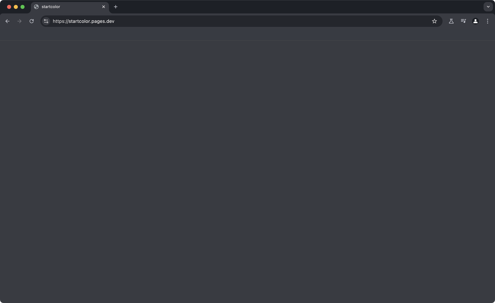

# startcolor

literally all this is is a page that i background color'd so that i don't need to see pinned tabs when i open chromium.

## you can use this too

the page is available to use at [startcolor.pages.dev](https://startcolor.pages.dev/). just copy the webpage and use it as the start up page for your browser.
